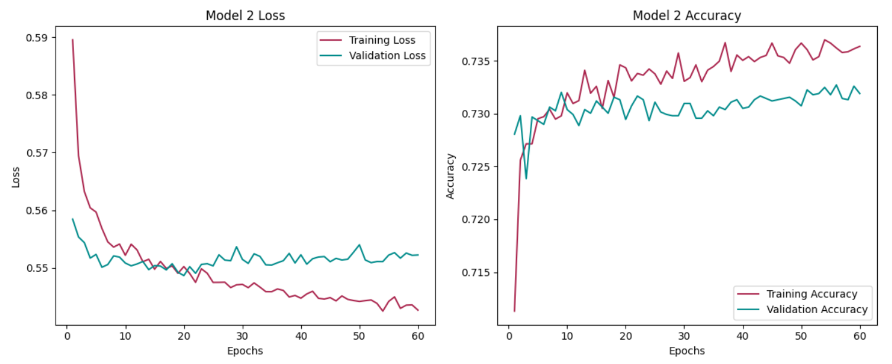
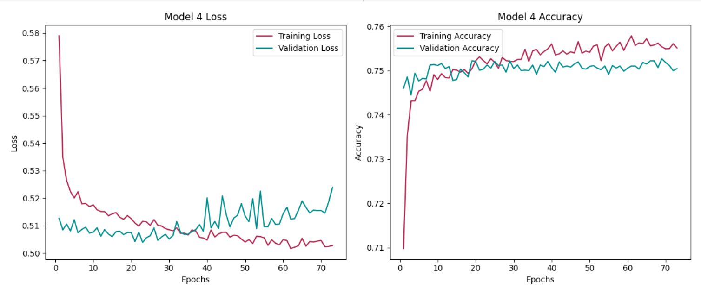

# dabc_challenge_21.neural_networks
Module 21 - Deep Learning homework

## Overview

For this assignment, I reviewed organization funding data from the nonprofit foundation Alphabet Soup, sourced from the IRS Tax Exempt Organization Bulk Data Downloads (https://www.irs.gov/). Alphabet Soup asked for a tool to predict whether applicants would be successful if their funding requests were granted, and I created multiple machine learning and neural network models to find one that would predict with high accuracy. The neural networks were created with the TensorFlow Keras API, and the additional machine learning models use varied classifiers from the SciKit-learn library.

## Data Preprocessing

My neural network process can be reviewed in the notebook AlphabetSoupCharity_nn.ipynb. 

The data needed some adjustments before it could be run through a machine learning model. For the first few models, I dropped columns that would not be useful such as "EIN" and "NAME", as well as columns with such high imbalance that they would yield no predictive power: "STATUS" and "SPECIAL_CONSIDERATIONS." 

I created buckets for multiple other columns such as "APPLICATION_TYPE" and "CLASSIFICATION" so that the values with high counts would remain but those with low counts would be grouped together into an "Other" category. This allowed for the neural networks to focus on the categories that might be statistically significant rather than edge cases. I then converted all categorical columns to numeric values using one-hot encoding and concatenated those columns with the original dataframe, dropping the categorical columns they replaced. 

Lastly, I split the data between the test features and the target array, which was the column "IS_SUCCESSFUL." The data was split with 75% being used as the training set and 25% saved for the testing set.

## Compiling, Training, and Evaluating the Neural Network Model

For my first neural network, I created 3 hidden layers with the rectified linear unit (relu) activation function and one output layer using the sigmoid function. The hidden networks contained a total of 70 neurons, which is double the amount of input features. I used binary cross-entropy to determine loss and the Adam optimizer, which is a self-tuning algorithm for learning rate to automatically adjust the feature weights to minimize loss.

The first model, AlphabetSoupCharity.h5, runs for 100 epochs and predicts with 73.11% accuracy and 55.55% loss.

The second model, saved as AlphabetSoupCharity2.h5, is optimized with increased neurons in the hidden layers to 175 total and includes an added dropout rate of 20% for each hidden layer as well as the early stopping rounds parameter to monitor validation loss with a minimum change of 0.00001 and patience of 40.

Model #2 runs for 200 epochs if the results don't trigger the early stopping rounds. It predicts with 72.94% accuracy and 54.87% loss.

To optimize model #3, AlphabetSoupCharity3.h5, I adjusted the scaler to only scale the originally numeric column, "ASK_AMT," and not the one-hot or label encoded columns. I increased the neurons to 375 total and added Batch Normalization to each hidden layer. I also increased the early stopping change threshold to 0.0001 and the patience to 50.

Model #3 predicts with 73.17% accuracy and 54.86% loss.

Since all three of these models produce similar outputs, I changed the preprocessing for the fourth model in attempt to realize a larger improvement. This time I kept and bucketed the "NAME" column to see if there is any statistical significance to the number of times an organization is grated funding. Those with less than 250 requests in the dataset were grouped into the "Other" category. The rest of the preprocessing was consistent with model #3 so I could directly compare the change in the preprocessing.

Model #4, AlphabetSoupCharity4.h5, predicts with 75.13% accuracy and 50.39% loss.

## Machine Learning

I created the second notebook, Alternative_Models.ipynb, with all of the same preprocessing used for the 4th neural network model. I included a function for creating and visualizing the results of various models, and then initiated different types of classification models to see how they rendered on this dataset. The models include Logistic Regression, a single Decision Tree, Random Forest, Support Vector Machine Classifier, K-Nearest Neighbors Classifier, Extra Trees Classifier, Adaptive Boost Classifier, Gradient Boosting Classifier, Extra Gradient Boosting Classifier, and Light Gradient Boost Classifier. 

Of all of these, the Extra Gradient Boosting model provided the highest metrics, with a test accuracy of 75% and test area under the Receiver Operating Characteristic (ROC) curve (AUC) of 81.30%. The precision scores of 79% for unsuccessful organizations and 72% for successful organizations show the percentage of time that Alphabet Soup could be correctly choosing which organizations to fund. The recall scores of 0.63 and 0.85 indicate that this model may predict false negatives 37% of the time for unsuccessful organizations and 15% of the time for successful organizations, which means the charity is more likely to avoid giving money to organizations that will fail than it is to refuse funding for organizations that could succeed.

## Summary

Overall, the 4th NN model and the XGBoost ML model perform similarly. Differences include the metrics we can view for each. The deep learning model tracks how both the training and validation data perform throughout each epoch, possibly showing us through plots how we could optimize the model further. The XGBoost model provides more metrics for interpreting the accuracy in detail, which is highly useful if the charity needs to budget for potential losses on funding of organizations that prove to be unsuccessful. Both models are useful and perhaps I would suggest using both, with the financial team reviewing the XGBoost model while the marketing team uses the NN model, prior to both teams coming together to determine how best to allocate their funding.